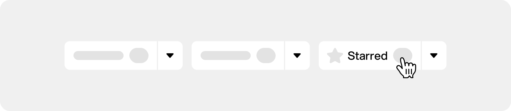
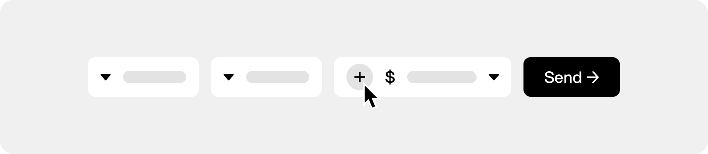

    

# Aspekta Typeface

A modern sans-serif collection inspired by a _clean_, _simple_ and _neutral_ style. The family provides a wide range of weights and stylistic alternatives that can be mixed to create **strong branding**.

#### [Download Latest Release](https://github.com/ivodolenc/aspekta/releases/latest)

# Features 🪄

- Free & `Open Source` project 🦸
- Available as a `Variable` typeface 🎚️
- Suitable for `Desktop` and `Web` use (ttf, otf, woff2) 📦
- Comes in `20` different styles (50-1000) 🤯
- Includes `source` files with 3 main masters 💎
- Supports `extra` Stylistic Sets (ss01, ss02) 🤩
- Provides custom `smart` components 🎛️
- Allows `easy` expansion 🧩

# Languages 🌐

- English 🇬🇧
- Croatian 🇭🇷
- Slovenian 🇸🇮
- Dutch 🇳🇱
- Spanish 🇪🇸
- German 🇩🇪
- Italian 🇮🇹

# Show Support ⭐

    

**Aspekta** is a `free` and `open source` typeface released under the [OFL License](LICENSE.txt). The source files are available to anyone whether they want to explore it or make a contribution.

If you like the project and found it useful, please spread the word and `leave a star`. It means a lot and gives motivation for further development.

Join the community and show your support. **Aspekta is for everyone!** 🙌

### Starring a repository

Navigate to the top-right corner of the page and click the <kbd>☆ Star</kbd> button.

# Send a Donation ☕

    

You can also support **Aspekta** with one-time donations — like buying coffee or sending an amount of your choice.

Individual donations are appreciated and will be mentioned in the [sponsors](SPONSORS.md) file.

### Payment platforms

<a href="https://revolut.me/ivodolenc">Revolut</a>
—
<a href="https://paypal.me/ivodolenc">PayPal</a>
—
<a href="https://www.buymeacoffee.com/ivodolenc">BuyMeACoffee</a>
—
<a href="https://ko-fi.com/ivodolenc">Ko-fi</a>

# Become a Sponsor 🤑

    

Help this project by funding development costs and take advantage of sponsorship benefits. It's a win-win!

Feel free to send a message for all inquiries via <a href="mailto:ivodolenc@gmail.com" title="ivodolenc@gmail.com">email</a> or <i title="ivodolenc#0591">Discord chat</i>.

  
<strong>Bronze — €50 / month</strong>

  

- Small logo placement on the repository [home](README.md) page
- Small logo placement in the [sponsors](SPONSORS.md) file
  

  
<strong>Silver — €100 / month</strong>

  

- Medium logo placement on the repository [home](README.md) page
- Medium logo placement in the [sponsors](SPONSORS.md) file
    

  

  
<strong>Gold — €200 / month</strong>

  

- Large logo placement on the repository [home](README.md) page
- Large logo placement in the [sponsors](SPONSORS.md) file
- Logo placement in a special section of each [release](https://github.com/ivodolenc/aspekta/releases)
  

  
<strong>Special 💎</strong>

  

- Let's discuss about this!
  

# Contributing 🤝

Check out the [Contributing Guide](CONTRIBUTING.md) for more info.

# License 📃

### Aspekta Typeface

[OFL 1.1 License](LICENSE.txt)

Copyright © Ivo Dolenc

Developed in Croatia 🇭🇷
